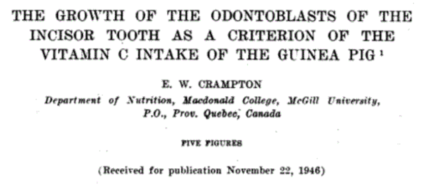
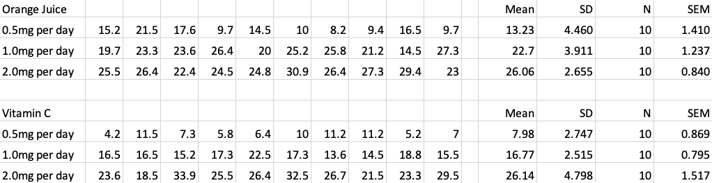
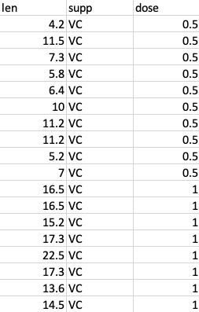

## Todays lecture

 1. Good practice for project organisation
 
 2. Data organisation (and visualisation) in practice 
 
 3. Statistical testing
 
 4. Power calculations

# Part 1: Project Organisation

## Organising your projects

Based on the papers:

 - **Good enough practices in scientific computing**:
    <BR>
    Wilson G, Bryan J, Cranston K, Kitzes J, Nederbragt L, Teal TK.  PLoS Comput Biol. 2017 Jun 22;13(6):e1005510.<BR> 
    doi: [10.1371/journal.pcbi.1005510](https://journals.plos.org/ploscompbiol/article?id=10.1371/journal.pcbi.1005510) 

 - **Ten Simple Rules for Reproducible Computational Research**
    <BR>
    Sandve GK, Nekrutenko A, Taylor J, Hovig E. PLoS Comput Biol. 2013 Oct;9(10):e1003285. 
    <BR>
    doi: [10.1371/journal.pcbi.1003285](https://journals.plos.org/ploscompbiol/article?id=10.1371/journal.pcbi.1003285)

## Not just for computational research...

 - Yes, both those papers are focused on "computational research".
 - BUT, most research we do contains the same basic elements:
    - experiments
    - data
    - analysis methods
    - results
    - collaboration
 - We need to keep all of these components ORGANIZED.

## Overview

Sections (we'll cover the <span style="color:blue">blue</span> stuff):

 - <p style="color:blue">Data Management</p>
 - <p style="color:blue">Software</p>
 - <p style="color:blue">Collaboration</p>
 - <p style="color:blue">Project Organization</p>
 - Keeping Track of Changes
 - Manuscripts
 - Ten Rules for Reproducible Computational Research

## Reproducibility + Efficiency + Continuity

 - For you:
    - recreate results (with ease)
    - reuse code and workflows
    - develop more efficient work habits
    
 - For everyone:
    - ensure reproducibility (and reduce burden)
    - establish workflows
    - enable collaboration
    - build upon existing work

# Quiz time...

## Not really, just some thinking

Spend two minutes thinking about the answers to the following questions:

1. If you were abducted by aliens in the next 30 seconds, how easy would it be for someone else to carry on your research? (after we finished mourning your loss, of course).

2. How much time would you need to spend getting your work to the point where another human being *could* carry on with your project?  What would this involve?

3. If you laptop/desktop was unexpectedly destroyed by evil anti-research forces, what impact would this have on your project? (it's ok, we'll buy you a shiny new one from our "anti-anti-research forces" insurance fund).

# Lets (briefly) discuss your answers...

## Data management

 1. Save the raw data.
    - preserve raw data - never edit
    - if needed, computationally create modified versions of raw data (e.g., data cleaning).
    
 2. Ensure raw data are backed up in more than one location
    - e.g., Biochem server + ITS High Capacity Storage, Biochem Server + Google Drive etc
    - <b>Data sensitivity</b> issues with cloud-based storage providers
    
 3. Create the data you wish to see in the world 
    - non-proprietary (preferably text-based) formats
    - informative variable and file names
    - make it the data set you wish you had received...

## Data management 
 
<ol start=4>
<li> Create analysis-friendly data

- each column is a variable
- each row is an observation
- tidy data aren't just for R...

<li> Record all the steps used to process data.

- if possible, use scripts to capture (and automate) every step of data processing and cleaning

</ol>

<!-- ## Data management -->

<!-- <ol start=6> -->

<!-- <li> Anticipate the need to use multiple tables, and use a unique identifier for every record. -->

<!--   - e.g., multiple CSV files linked by a common sample ID -->
<!--   - combine data programmatically  -->

<!-- <li> Submit data to a reputable DOI-issuing repository so that others can access and cite it. -->

<!--  - Zenodo: https://zenodo.org -->
<!--  - Dryad: https://datadryad.org -->
<!--  - FigShare: https://figshare.com -->

<!-- <p style="color:red">**But first: CAN you share your data?**</p> -->

<!-- </ol> -->

## Software (scripts, code etc)

1. Place a brief explanatory comment at the start of every program.
  
    - explain what the code does, and how to use it.
    - if approriate, include example of usage.
  
2. Decompose programs into functions.
 
    - breaks tasks into small (well-documented) chunks
    - digestible => understandable
  
3. Be ruthless about eliminating duplication.
 
    - use functions
    - don't copy and paste code chunks (write a function)
 
## Software (scripts, code etc)
 
<ol start=4> 
 
<li> Always search for well-maintained software libraries that do what you need.

  - don't reinvent the wheel...
 
<li> Test libraries before relying on them.
 
<li> Give functions and variables meaningful names.

  - use tab completion with informative names
 
<li> Make dependencies and requirements explicit.

  - can be as simple as adding a `requirements.txt` file.

</ol>

<!-- ## Software (scripts, code etc) -->

<!-- <ol start=8>  -->

<!-- <li> Do not comment and uncomment sections of code to control a program's behavior. -->

<!--   - error prone -->
<!--   - use `if/else` statements instead -->

<!-- <li> Provide a simple example or test data set. -->

<!--   - also good for you to help with testing -->
<!--   - and great for running workshops! -->

<!-- <li> Submit code to a reputable DOI-issuing repository. -->

<!-- </ol> -->

# Even if you are not working<BR>as part of a team...<BR><BR><BR>

# Even if you are not working<BR> as part of a team...<BR><BR>...YOU ARE!!

## Collaboration 

 - Your project is very likely to be part of a larger research programme, and the work you are doing has the potential to contribute to other projects in the future.
 
 - You are also collaborating with yourself: ask "present Mik" about his good friend "future Mik".
 
## Collaboration 

1. Create an overview of your project.

    - `README.txt` or `README.md` in top-level directory
    
2. Create a shared "to-do" list for the project.

    - even if it is just for you...

3. Decide on communication strategies.


# Quiz Time...

## Whose project folder looks like this?

<center>

</center>

## Find a partner...

 - Spend two minutes discussing how you organise your projects.
 - Think about:
    - directory structure
    - documentation
    - where different types of files are kept

# This stuff is critical...

## Project Organisation 

1. Put each project in its own directory, which is named after the project.

2. Put text documents associated with the project in the `doc` directory.

3. Put raw data and metadata in a data directory and files generated during cleanup and analysis in a results directory.
 
    - critical to separate input data from derived data
    - don't be afraid to use subdirectories to impose additional order
 
## Project Organisation 

<ol start=4>  
 
<li> Put project source code in the src directory.
 
  - Interpreted: R, Python
  - Compiled: C++, Fortran, Java
  - Shell scripts, SQL snippets

<li> Put external scripts or compiled programs in the bin directory.

  - may not be relevant for some projects (e.g., if not using compiled code)
  - why external scripts here? Can make distinction for edited vs non-edited files: binary files and external scripts are not directly edited.

<li> Name all files to reflect their content or function.

</ol>

## Example: project layout

```
|-- CITATION
|-- README
|-- LICENSE
|-- requirements.txt
|-- data
|    |-- birds_count_table.csv
|-- doc
|    |-- notebook.md
|    |-- manuscript.md
|    |-- changelog.txt
|-- results
|    |-- summarized_results.csv
|-- src
|    |-- sightings_analysis.py
|    |-- runall.py
```

<font size="2">
Wilson G, Bryan J, Cranston K, Kitzes J, Nederbragt L, Teal TK.  PLoS Comput Biol. 2017 Jun 22;13(6):e1005510.<BR>
[10.1371/journal.pcbi.1005510](https://journals.plos.org/ploscompbiol/article?id=10.1371/journal.pcbi.1005510) 
</font>
 
## Tools and habits

 - Tools **enable** reproducible research
    - there are lots of them
    - they are not hard to learn

 - Good habits **ensure** reproducible research
    - there are many good habits: each one will improve your work in some way
    - these **are** hard to learn (actually, that is not true - it is just hard to **unlearn** your bad habits)
 - Getting into the habit of using these "good practice tools" as a central part of your workflow is critical
 - It takes commitment, but it will be hugely beneficial
 
# Part 2: Data Organisation

## Data organization

 - A spreadsheet application (e.g., Microsoft Excel) is often used to “organize” data.
    - Excel has the ability to make raw data look very pretty.
    - Statistics applications (e.g., SPSS, R, SAS, Prism) often have trouble reading in the pretty data.
 - Try to keep it simple:
    - Samples in rows, variables in columns
    - No blank cells or rows (unless data are missing)

## Example data

We're going to use some really old data as an example:
 
<center></center>

<BR>

We'll start off looking at a fairly typical (Excel-based) approach to data organisation and analysis.

## "Tooth Growth" data set

 - Length of odontoblasts (cells responsible for tooth growth) in 60 guinea pigs
 - Guinea pigs exposed to different doses of Vitamin C, via two different mechanisms.
 - Variables in data set:
      - len = Tooth length (unit unknown...)
      - supp = Vitamin C Supplement: ascorbic acid (VC) or Orange Juice (OJ)
      - dose = Dose in milligrams/day
 - Let's look at how that data "might" get recorded in a typical study.

## Tooth Growth data

Often the data would be recorded in Excel, using a format somewhat like this:

<center></center>


## Tooth Growth data + summary

Excel makes it easy to add summary dat such as:

 - Mean ($\bar x$): `=AVERAGE()`
 - Standard Deviation ($s$): `=STDEV()`
 - Observations per group ($N$): `=COUNT()`
 - Standard error of the mean ($SEM$): <font color='black'>`=`$\frac{\bar x}{s/\sqrt N}$</font>

<center></center>

## Summary data 

<center></center>

<BR>

Often want to plot this summary data

  - bar plot per group
  - add error bars

## And Excel lets you!

<center></center>

<BR>

<center></center>

## And what's more...

<font color='black'>
<b>YOU CAN MAKE THE PLOT RIGHT IN THE EXCEL SHEET!</b> 
🤦
</font>

<BR>
<center></center>


# Let's pause...


## Principles of data organisation

<br><br><br><br><br><br>
<center>
<font size=12 color='black'>
<b>How many did we just break?</b>
</font>
</center>

## Principles of project/data organisation

How many did we just break?

 - create analysis-friendly data
 - non-proprietary format 
 - preserve raw data - never edit
 - record all the steps used to process data
 - separate input data from derived data
 
## How can we fix this?

 - Raw data:
    - analysis-friendly data: re-format data
    - non-proprietary format: save as `.csv` file (comma-separated value: still opens in Excel, but is text-based, so easy to open elsewhere)
    - preserve raw data: separate the data from the analysis
 - Analysis
    - record all the steps: use a script-based language (e.g., R or Python)
    - separate input data from derived data: use script to read raw data and produce outputs

## Data format

Each column is a variable, each row is an observation.

<center></center>

<BR>
Save as a `.csv` file, and store in separate `Data` folder.

## Analysis

 - R (or Python) can be used to process, visualise and analyse the data.
 - Let's have a look at a typical R workflow for this.
 

```r
# Read in the data
tooth_growth = read.csv('Data/tooth-growth-long-format.csv')

# Look at the first few rows
head(tooth_growth)
```

```
##    len supp dose
## 1  4.2   VC  0.5
## 2 11.5   VC  0.5
## 3  7.3   VC  0.5
## 4  5.8   VC  0.5
## 5  6.4   VC  0.5
## 6 10.0   VC  0.5
```

## Summarize data

The `dplyr` package for R provides a nice way to generate data summaries.


```r
# Load dplyr package
library(dplyr)
```

```
## 
## Attaching package: 'dplyr'
```

```
## The following objects are masked from 'package:stats':
## 
##     filter, lag
```

```
## The following objects are masked from 'package:base':
## 
##     intersect, setdiff, setequal, union
```

```r
# Generate data summary object (tg_summary)
tg_summary = tooth_growth %>% 
  group_by(supp, dose) %>%  
  summarize( MeanLength = mean(len), 
             SD = sd(len), 
             N = n(), 
             SEM = MeanLength / (SD / N) )
```

## Summarize data

What does this produce?


```r
# Show the tg_summary object
tg_summary
```

```
## # A tibble: 6 x 6
## # Groups:   supp [2]
##   supp   dose MeanLength    SD     N   SEM
##   <chr> <dbl>      <dbl> <dbl> <int> <dbl>
## 1 OJ      0.5      13.2   4.46    10  29.7
## 2 OJ      1        22.7   3.91    10  58.0
## 3 OJ      2        26.1   2.66    10  98.2
## 4 VC      0.5       7.98  2.75    10  29.1
## 5 VC      1        16.8   2.52    10  66.7
## 6 VC      2        26.1   4.80    10  54.5
```

## R can even make it look pretty(ish)


```r
tg_summary %>% knitr::kable(., digits=2) 
```


|supp | dose| MeanLength|   SD|  N|   SEM|
|:----|----:|----------:|----:|--:|-----:|
|OJ   |  0.5|      13.23| 4.46| 10| 29.67|
|OJ   |  1.0|      22.70| 3.91| 10| 58.04|
|OJ   |  2.0|      26.06| 2.66| 10| 98.15|
|VC   |  0.5|       7.98| 2.75| 10| 29.05|
|VC   |  1.0|      16.77| 2.52| 10| 66.67|
|VC   |  2.0|      26.14| 4.80| 10| 54.48|


## Getting some data

 - Download some small example data sets:
   https://github.com/mikblack/BIOC461-stats/blob/master/DataSets.zip?raw=true
 - Download the file, unzip it, and move the contents to where you would like to save your work.
 - For example, create a folder on your desktop called `BIOC461`, and move the `DataSets` folder there.
 - The `DataSets` folder should contain five files:
    - calcium.csv
    - corn.csv
    - morphine.csv
    - mouseExample.csv
    - pigs.csv

## In RStudio - "start a project"

 - Choose `New Project...` from the `File` menu (or from the `Project` pulldown at the top right of the RStudio window).
 - Select `Existing Directory` and then browse to your BIOC461 folder (e.g., on the desktop) - click on the folder to highlight it, and then click `Open`.
 - The `Project Working Directory` should now show the path to your `BIOC461` folder - if not, click `Browse` again and fix it, otherwise
 click `Create Project`.
 - RStudio will now resart, and the `Files` pane should be displaying the contents your `BIOC461` folder.
 - Now select `New File` and then `R Script` from the `File` menu - this is where we will save the commands we use for our data analysis.


## Loading the data
    

```r
## Load the data into R from a CSV file
## mouseData = read.csv('DataSets/mouseExample.csv')
```
