```{r setup, include=FALSE}
knitr::opts_chunk$set(echo = TRUE)
```

## Today's lecture

 1. Good practice for project organisation
 
 2. Data organisation (and visualisation) in practice 
 
 3. Statistical testing
 
 4. P-hacking

## Assessment

10% assessment in class

 - Select a small dataset produced in your lab.
 
 - Compare how well the dataset confirms to the practices we discuss today.
 
 - How could this dataset be analysed and visualised?
 
 - Prepare a brief (~5mins) presentation for next week.
 
 Further details are on Blackboard.

# Part 1: Project Organisation

## Organising your projects

Based on the papers:

 - **Good enough practices in scientific computing**:
    <BR>
    Wilson G, Bryan J, Cranston K, Kitzes J, Nederbragt L, Teal TK.  PLoS Comput Biol. 2017 Jun 22;13(6):e1005510.<BR> 
    doi: [10.1371/journal.pcbi.1005510](https://journals.plos.org/ploscompbiol/article?id=10.1371/journal.pcbi.1005510) 

 - **Ten Simple Rules for Reproducible Computational Research**
    <BR>
    Sandve GK, Nekrutenko A, Taylor J, Hovig E. PLoS Comput Biol. 2013 Oct;9(10):e1003285. 
    <BR>
    doi: [10.1371/journal.pcbi.1003285](https://journals.plos.org/ploscompbiol/article?id=10.1371/journal.pcbi.1003285)

## Not just for computational research...

 - Yes, both those papers are focused on "computational research".
 - BUT, most research we do contains the same basic elements:
    - experiments
    - data
    - analysis methods
    - results
    - collaboration
 - We need to keep all of these components ORGANIZED.

## Overview

Sections (we'll cover the <span style="color:blue">blue</span> stuff):

 - <p style="color:blue">Data Management</p>
 - <p style="color:blue">Software</p>
 - <p style="color:blue">Collaboration</p>
 - <p style="color:blue">Project Organization</p>
 - Keeping Track of Changes
 - Manuscripts
 - Ten Rules for Reproducible Computational Research

## Reproducibility + Efficiency + Continuity

 - For you:
    - recreate results (with ease)
    - reuse code and workflows
    - develop more efficient work habits
    
 - For everyone:
    - ensure reproducibility (and reduce burden)
    - establish workflows
    - enable collaboration
    - build upon existing work

# Quiz time...

## Not really, just some thinking

Spend two minutes thinking about the answers to the following questions:

1. If you were abducted by aliens in the next 30 seconds, how easy would it be for someone else to carry on your research? (after we finished mourning your loss, of course).

2. How much time would you need to spend getting your work to the point where another human being *could* carry on with your project?  What would this involve?

3. If your laptop/desktop was unexpectedly destroyed by evil anti-research forces, what impact would this have on your project? (it's ok, we'll buy you a shiny new one from our "anti-anti-research forces" insurance fund).

# Let's (briefly) discuss your answers...

## Data management

 1. Save the raw data.
    - preserve raw data - never edit
    - if needed, computationally create modified versions of raw data (e.g., data cleaning).
    
 2. Ensure raw data are backed up in more than one location
    - e.g., Biochem server + ITS High Capacity Storage, Biochem Server + Google Drive etc (<b>See Murray Cadzow's slides on BB</b>)
    - <b>Data sensitivity</b> issues with cloud-based storage providers
    
 3. Create the data you wish to see in the world 
    - non-proprietary (preferably text-based) formats
    - informative variable and file names
    - make it the data set you wish you had received...

## Data management 
 
<ol start=4>
<li> Create analysis-friendly data

- each column is a variable
- each row is an observation
- tidy data aren't just for R...

<li> Record all the steps used to process data.

- if possible, use scripts to capture (and automate) every step of data processing and cleaning

</ol>

<!-- ## Data management -->

<!-- <ol start=6> -->

<!-- <li> Anticipate the need to use multiple tables, and use a unique identifier for every record. -->

<!--   - e.g., multiple CSV files linked by a common sample ID -->
<!--   - combine data programmatically  -->

<!-- <li> Submit data to a reputable DOI-issuing repository so that others can access and cite it. -->

<!--  - Zenodo: https://zenodo.org -->
<!--  - Dryad: https://datadryad.org -->
<!--  - FigShare: https://figshare.com -->

<!-- <p style="color:red">**But first: CAN you share your data?**</p> -->

<!-- </ol> -->

## Software (scripts, code etc)

1. Place a brief explanatory comment at the start of every program.
  
    - explain what the code does, and how to use it.
    - if appropriate, include examples of usage.
  
2. Decompose programs into functions.
 
    - breaks tasks into small (well-documented) chunks
    - digestible => understandable
  
3. Be ruthless about eliminating duplication.
 
    - use functions
    - don't copy and paste code chunks (write a function)
 
## Software (scripts, code etc)
 
<ol start=4> 
 
<li> Always search for well-maintained software libraries that do what you need.

  - don't reinvent the wheel...
 
<li> Test libraries before relying on them.
 
<li> Give functions and variables meaningful names.

  - use tab completion with informative names
 
<li> Make dependencies and requirements explicit.

  - can be as simple as adding a `requirements.txt` file.

</ol>

<!-- ## Software (scripts, code etc) -->

<!-- <ol start=8>  -->

<!-- <li> Do not comment and uncomment sections of code to control a program's behaviour. -->

<!--   - error prone -->
<!--   - use `if/else` statements instead -->

<!-- <li> Provide a simple example or test data set. -->

<!--   - also good for you to help with testing -->
<!--   - and great for running workshops! -->

<!-- <li> Submit code to a reputable DOI-issuing repository. -->

<!-- </ol> -->

# Even if you are not working<BR>as part of a team...<BR><BR><BR>

# Even if you are not working<BR> as part of a team...<BR><BR>...YOU ARE!!

## Collaboration 

 - Your project is very likely to be part of a larger research programme, and the work you are doing has the potential to contribute to other projects in the future.
 
 - You are also collaborating with yourself: ask "present you" about your good friend "future you".
 
## Collaboration 

1. Create an overview of your project.

    - `README.txt` or `README.md` in the top-level directory
    
2. Create a shared "to-do" list for the project.

    - even if it is just for you...

3. Decide on communication strategies.


# Quiz Time...

## Whose project folder looks like this?

<!-- 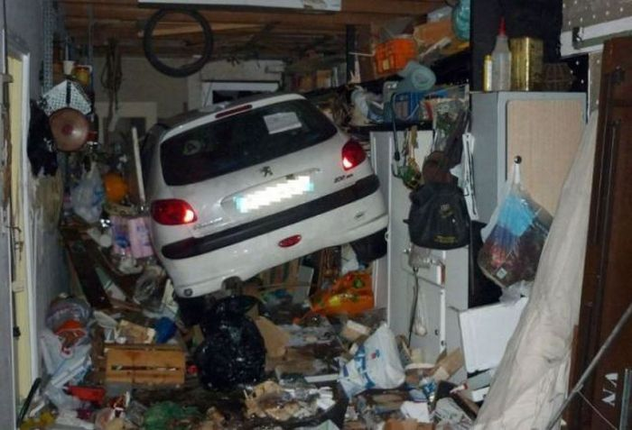 -->
<center>
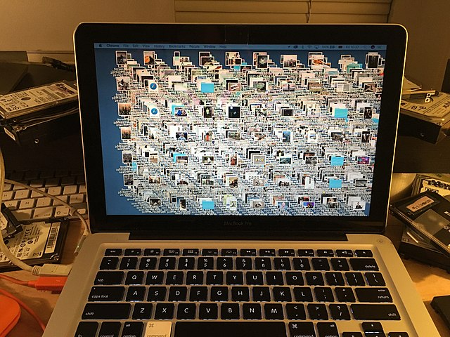
</center>

Image source: [Wikimedia Commons File:Exampleofdigitalhoarding cluttereddesktop001.jpg](https://commons.wikimedia.org/wiki/File:Exampleofdigitalhoarding_cluttereddesktop001.jpg)

## Find a partner...

 - Spend two minutes discussing how you organise your projects.
 - Think about:
    - directory structure
    - documentation
    - where different types of files are kept

# This stuff is critical...

## Project Organisation 

1. Put each project in its own directory, which is named after the project.

2. Put text documents associated with the project in the `doc` directory.

3. Put raw data and metadata in a data directory and files generated during cleanup and analysis in a results directory.
 
    - critical to separate input data from derived data
    - don't be afraid to use subdirectories to impose additional order
 
## Project Organisation 

<ol start=4>  
 
<li> Put project source code in the src directory.
 
  - Interpreted: R, Python
  - Compiled: C++, Fortran, Java
  - Shell scripts, SQL snippets

<li> Put external scripts or compiled programs in the bin directory.

  - may not be relevant for some projects (e.g., if not using compiled code)
  - why external scripts here? So you can make a distinction for edited vs non-edited files: binary files and external scripts are not directly edited.

<li> Name all files to reflect their content or function.

</ol>

## Example: project layout

```
|-- CITATION
|-- README
|-- LICENSE
|-- requirements.txt
|-- data
|    |-- birds_count_table.csv
|-- doc
|    |-- notebook.md
|    |-- manuscript.md
|    |-- changelog.txt
|-- results
|    |-- summarized_results.csv
|-- src
|    |-- sightings_analysis.py
|    |-- runall.py
```

<font size="2">
Wilson G, Bryan J, Cranston K, Kitzes J, Nederbragt L, Teal TK.  PLoS Comput Biol. 2017 Jun 22;13(6):e1005510.<BR>
[10.1371/journal.pcbi.1005510](https://journals.plos.org/ploscompbiol/article?id=10.1371/journal.pcbi.1005510) 
</font>
 
## Tools and habits

 - Tools **enable** reproducible research
    - there are lots of them
    - they are not hard to learn

 - Good habits **ensure** reproducible research
    - there are many good habits: each one will improve your work in some way
    - these **are** hard to learn (actually, that is not true - it is just hard to **unlearn** your bad habits)
 - Getting into the habit of using these "good practice tools" as a central part of your workflow is critical
 - It takes commitment, but it will be hugely beneficial
 
# Part 2: Data Organisation

## Data organization

 - A spreadsheet application (e.g., Microsoft Excel) is often used to “organize” data.
    - Excel has the ability to make raw data look very pretty.
    - Statistics applications (e.g., SPSS, R, SAS, Prism) often have trouble reading pretty data.
 - Try to keep it simple:
    - Samples in rows, variables in columns
    - No blank cells or rows (unless data are missing)

## Example data

We're going to use some really old data as an example:
 
<center>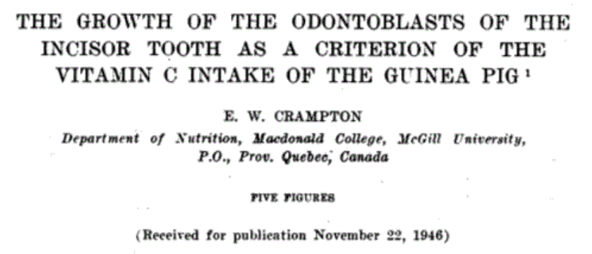</center>

<BR>

We'll start by looking at a fairly typical (Excel-based) approach to data organisation and analysis.

## "Tooth Growth" data set

 - Length of odontoblasts (cells responsible for tooth growth) in 60 guinea pigs
 - Guinea pigs exposed to different doses of Vitamin C, via two different mechanisms.
 - Variables in the data set:
      - len = Tooth length (unit unknown...)
      - supp = Vitamin C Supplement: ascorbic acid (VC) or Orange Juice (OJ)
      - dose = Dose in milligrams/day
 - Let's look at how that data "might" get recorded in a typical study.

## Tooth Growth data

Often the data would be recorded in Excel, using a format somewhat like this:

<center>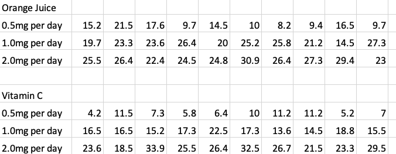</center>


## Tooth Growth data + summary

Excel makes it easy to add summary dat such as:

 - Mean ($\bar x$): `=AVERAGE()`
 - Standard Deviation ($s$): `=STDEV()`
 - Observations per group ($N$): `=COUNT()`
 - Standard error of the mean ($SEM$): <font color='black'>`=`$\frac{s}{\sqrt N}$</font>

<center>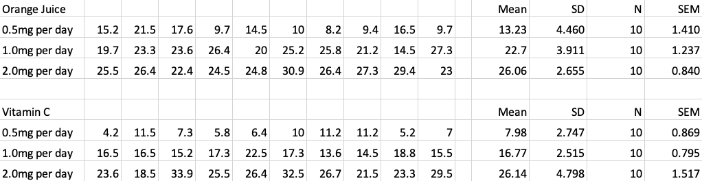</center>

## Summary data 

<center>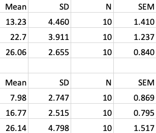</center>

<BR>

Often want to plot this summary data

  - bar plot per group
  - add error bars

## And Excel lets you!

<center>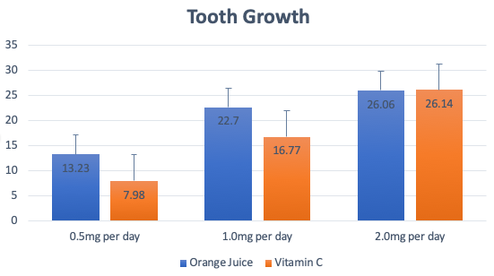</center>

<BR>

<center></center>

## And what's more...

<font color='black'>
<b>YOU CAN MAKE THE PLOT RIGHT IN THE EXCEL SHEET!</b> 
       `r #emo::ji('person_facepalming')`
</font>

<BR>
<center>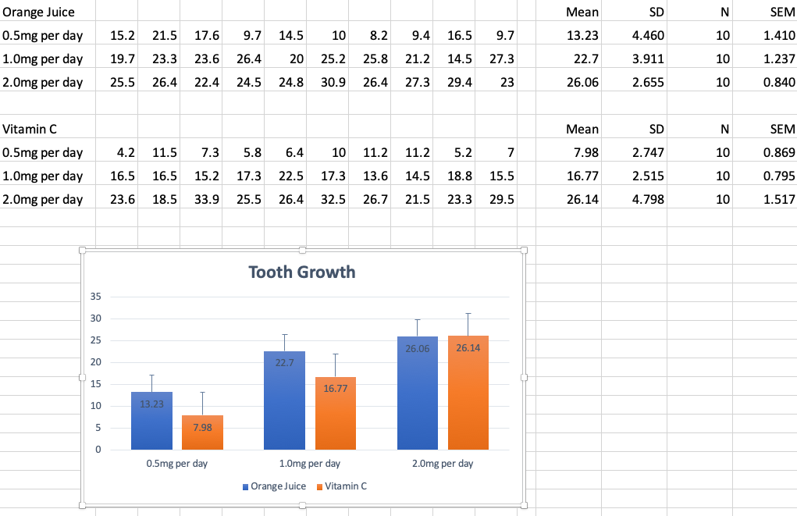</center>


# Let's pause...


## Principles of project/data organisation

<br><br><br><br><br><br>
<center>
<font size=12 color='black'>
<b>How many did we just break?</b>
</font>
</center>

## Principles of project/data organisation

How many did we just break?

 - create analysis-friendly data
 - non-proprietary format 
 - preserve raw data - never edit
 - record all the steps used to process data
 - separate input data from derived data
 
## How can we fix this?

 - Raw data:
    - analysis-friendly data: re-format data
    - non-proprietary format: save as `.csv` file (comma-separated value: still opens in Excel, but is text-based, so easy to open elsewhere)
    - preserve raw data: separate the data from the analysis
 - Analysis
    - record all the steps: use a script-based language (e.g., R or Python)
    - separate input data from derived data: use a script to read raw data and produce outputs

## Data format

Each column is a variable, each row is an observation.

<center></center>

<BR>
Save as a `.csv` file, and store in a separate `Data` folder.

## Analysis

 - R (or Python) can be used to process, visualise and analyse the data.
 - Let's have a look at a typical R workflow for this.
 
```{r}
# Read the data
tooth_growth = read.csv('Data/tooth-growth-long-format.csv')

# Look at the first few rows
head(tooth_growth)
```

## Summarize data

The `dplyr` package for R provides a nice way to generate data summaries.

```{r, message=FALSE, warning=FALSE}
# Load dplyr package
library(dplyr)
# Generate data summary object (tg_summary)
tg_summary = tooth_growth %>% 
  group_by(supp, dose) %>%  
  summarize( MeanLength = mean(len), 
             SD = sd(len), 
             N = n(), 
             SEM = SD / sqrt(N) )
```

## Summarize data

What does this produce?

```{r}
# Show the tg_summary object
tg_summary
```

## R can even make it look pretty(ish)

```{r}
tg_summary %>% knitr::kable(., digits=2) 
```

## How to plot?

 - The `ggplot2` package for R has become (by far) the most popular tool for producing publication quality figures in R.
 - It takes a little bit of effort (and Googling) to learn the syntax, but it is an <em>extremely</em> powerful and flexible tool.
 - Murray Cadzow runs courses that teach R and `ggplot` basics - these are well worth attending.
 - Let's have a look at generating a bar plot of our summary data in R.
 
## Barplot: the code

R code for barplot with `ggplot2`

```{r, eval=FALSE}
# Load the ggplot2 package
library(ggplot2)
# Create a basic bar plot
ggplot(tg_summary, aes(x=as.factor(dose), y=MeanLength, fill=supp)) + 
  geom_bar(stat="identity", position="dodge")
```

Breaking down the code:

 - `ggplot` takes the data object (`tg_summary`), converts `dose` to a factor, plots `dose` on the x-axis and `MeanLength` on the y-axis, and uses `supp` to define colours.
 - `geom_bar` generates the barplot, using the values from `tg_sumamry` (`identity`) and puts the bars next to each other (`dodge`).

## Barplot: the output

```{r, message=FALSE, warning=FALSE, echo=FALSE}
library(ggplot2)
```

```{r fig.height=4.5}
ggplot(tg_summary, aes(x=as.factor(dose), y=MeanLength, fill=supp)) + 
  geom_bar(stat="identity", position="dodge")
```

## Barplot: without `as.factor`

```{r fig.height=4.5}
ggplot(tg_summary, aes(x=dose, y=MeanLength, fill=supp)) + 
  geom_bar(stat="identity", position="dodge")
```

## Barplot: without `dodge`

```{r fig.height=4.5}
ggplot(tg_summary, aes(x=as.factor(dose), y=MeanLength, fill=supp)) + 
  geom_bar(stat="identity") 
```

## Making it prettier

```{r fig.height=4}
ggplot(tg_summary, aes(x=as.factor(dose), y=MeanLength, fill=supp)) + 
  geom_bar(stat="identity", position="dodge") + 
  labs(title="Tooth length per dose", x="Dose (mg)", 
       y = "Mean length", fill='Supplement')
```

## And... error bars

```{r fig.height=3.5}
ggplot(tg_summary, aes(x=as.factor(dose), y=MeanLength, fill=supp)) + 
  geom_bar(stat="identity", position="dodge") + 
  labs(title="Tooth length per dose", x="Dose (mg)", 
       y = "Mean length", fill='Supplement') +
  geom_errorbar(aes(ymin=MeanLength-SEM, ymax=MeanLength+SEM),
                    position=position_dodge(0.9), width=0.2)
```

## Error bars: upper bar only (change plotting order)

```{r fig.height=3.5}
ggplot(tg_summary, aes(x=as.factor(dose), y=MeanLength, fill=supp)) + 
  labs(title="Tooth length per dose", x="Dose (mg)", 
       y = "Mean length", fill='Supplement') +
  geom_errorbar(aes(ymin=MeanLength-SEM, ymax=MeanLength+SEM),
                    position=position_dodge(0.9), width=0.2) +
  geom_bar(stat="identity", position="dodge") 
```

## Aside: why are we plotting the SEM?

 - The sample standard deviation, $s$, measures the spread of the sample observations around the sample mean
 - When we test for differences between the groups, we are testing to see if the <em>means</em> are the same.
 - To do this we use the standard error of the mean (SEM, or SE):
 
<center> 
$SEM = \frac{s}{\sqrt N}$
</center>
<BR>

 - It measures our certainty in our estimate of the population mean, (we are assuming that the sample mean, $\bar x$ provides an estimate of the true population mean, $\mu$).
 - As we increase the sample size, $N$, the SEM gets smaller, because with more data, we have a better estimate of $\mu$.
 
## Aside: a more informative plot?

```{r fig.height=2.8}
ggplot(tooth_growth, aes(x=as.factor(dose), y=len, fill=supp)) + 
  labs(title="Tooth length per dose", x="Dose (mg)", 
       y = "Length", fill='Supplement') +
  geom_boxplot(outlier.alpha = 0) + 
  geom_jitter(position = position_jitterdodge(jitter.width=0.12), alpha=0.7)
```

## Datasaurus

<center>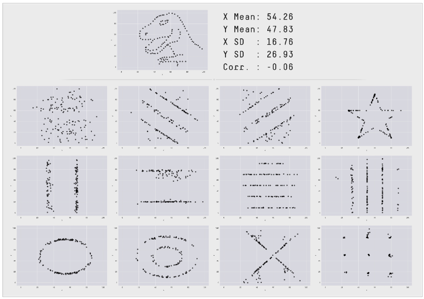</center>

 - URL: [https://www.autodesk.com/research/publications/same-stats-different-graphs?s=03](https://www.autodesk.com/research/publications/same-stats-different-graphs?s=03) 


# Part 3 - Statistical Testing

## Two sample test

Let's start with a smaller data set: just the OJ vs VC data for a dose of 1mg.

```{r}
# Read in a reduced data set
tg_1mg = read.csv('Data/tooth-growth-long-format-dose-1mg.csv')
# Show the first few rows
head(tg_1mg)
```

## Plot the data

```{r, fig.height=3.2, fig.width=5.5}
ggplot(tg_1mg, aes(x=supp, y=len)) + 
  labs(title="Tooth length vs Supplement (1mg dose)", x="Supplement", y = "Length") +
  geom_boxplot(outlier.alpha = 0, width=0.3) + geom_jitter(width=0.12, alpha=0.7)
```

## Hypothesis testing

 - We'd like to formally test for a difference between the means of OJ and VC.
 - Standard hypothesis testing setup:
    - H<sub>0</sub>: the population means are same
    - H<sub>A</sub>: the population means are different
 - Assuming that the data are normally distributed, we can use a t-test for this:
    - $T = \frac{\bar x_1 - \bar x_2}{SE(\bar x_1 - \bar x_2)} = \frac{\bar x_1 - \bar x_2}{\sqrt {\frac{s_1^2}{n_1} + \frac{s_2^2}{n_2}}}\ \ \ \ $ (SE for unequal variance across groups)
    - If H<sub>0</sub> is true (i.e., no difference between the means) then $T$ will follow a t-distribution, and we can use this to calculate a p-value.
    
## T-test

In R we can perform a t-test between OJ and VC mean lengths via:

```{r}
t.test(len ~ supp, data = tg_1mg)
```

The p-value is `r round(t.test(len ~ supp, data = tg_1mg)$p.value,5)`, which suggests a difference between the means of this size is unlikely to occur by chance if H<sub>0</sub> is true.

## What if data aren't normal?

 - If the data aren't normally distributed (e.g., skewed, bimodal etc), we can use <em>non-parametric</em> methods.
 - Note, it may be hard to determine normality when your sample sizes are small.
 - The non-parametric analog to the t-test is the Wilcoxon Rank-Sum Test.
     - tests for a difference between the two groups by ranking the combined data, and then testing to see if the ranks are distributed differently (enough) across the groups.
     - in R this is implemented by the `wilcox.test()` function.
     
## Rank-based data

```{r, echo=FALSE, eval=FALSE}
# NB - made these and then screen captured
stripchart(len ~ supp, data=tg_1mg, method='stack', pch=20, cex=2,
           ylim=c(0.75,2.25), xlab='Length')
stripchart(rank(len) ~ supp, data=tg_1mg, method='stack', pch=20, cex=2,
           ylim=c(0.75,2.25), xlab='Rank')
```

Stripcharts of the length distributions for each group:

<center>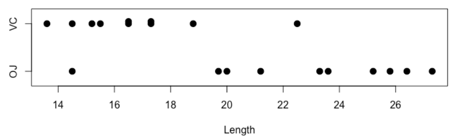</center>

Converted to ranks, the data look like this:

<center>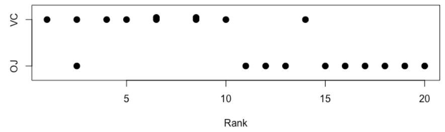</center>

Wilcoxon test ignores the length distribution, and tests for rank-based differences.

## Wilcoxon test

```{r}
wilcox.test(len ~ supp, data = tg_1mg)
```

P-value (`r round(wilcox.test(len ~ supp, data = tg_1mg)$p.value, 4)`) again suggests there is a significant length difference between the groups.

NB: the warning just means that an approximation is being used to calculate the p-value, as there are ties present in the data (same value).

## Testing more hypotheses

Let's return to the full tooth length data set.

```{r fig.height=3, echo=FALSE}
ggplot(tooth_growth, aes(x=as.factor(dose), y=len, fill=supp)) + 
  labs(title="Tooth length per dose", x="Dose (mg)", 
       y = "Length", fill='Supplement') +
  geom_boxplot(outlier.alpha = 0) + 
  geom_jitter(position = position_jitterdodge(jitter.width=0.12), alpha=0.7)
```

 - If we wanted to test for VC vs OJ at each dose level, we'd need to perform three hypothesis tests.

 - Note that there are better statistical ways to perform this analysis, but we'll keep it simple.

## Three hypothesis tests

```{r}
# Create empty vector to fill with p-values
pval = c()

# Dose = 0.5
pval[1] = t.test(len ~ supp, data = tooth_growth %>% filter(dose==0.5) )$p.value

# Dose = 1
pval[2] = t.test(len ~ supp, data = tooth_growth %>% filter(dose==1) )$p.value

# Dose = 2
pval[3] = t.test(len ~ supp, data = tooth_growth %>% filter(dose==2) )$p.value

# Show p-values
names(pval) = c("Dose_0.5mg", "Dose_1.0mg", "Dose_2.0mg")
pval
```

## Multiple hypothesis testing

 - Based on the three p-values, it looks like there is a difference in length at doses 0.5mg and 1.0mg, but not 2.0mg (amusing that p < 0.05 indicates significance).
    - By setting a significance at $\alpha$ = 0.05, we are specifying the Type I error rate for our tests - also known as the false positive rate.
    - For a test where H<sub>0</sub> is true, we will incorrectly detect a difference between the means 100$\alpha$% of the time (i.e., 5%).
    - The error probability applies to each test - so we have a 5% chance of error for each test that we perform. 
 - If we are performing a large number of tests (e.g., genome-wide testing of 1 million SNP loci), then we can expect to make a large number of errors (on average, 0.05 x 1,000,000 = 50,000) in a situation where H<sub>0</sub> is true for most tests.
 
## Multiple testing corrections

 - To prevent large numbers of false positives when testing many hypotheses, we employ <b>multiple testing correction</b>. Two ways to think about it:
 
    - make the p-values BIGGER, and use the same threshold
    - make the threshold SMALLER, and use the same p-values
    
 - In Genome-Wide Association Studies (GWAS), the latter approach is generally used: typical genome-wide significance is set at 5x10<sup>-8</sup>.
    - Bonferroni Correction: $\alpha^{*} = \frac{\alpha}{\mathrm{number~of~tests}} = \frac{0.05}{1000000} = 5\times10^{-8}$
    - P-value < 5x10<sup>-8</sup> is required for significance.
    - Alternatively, could multiply each p-value by 1,000,000 and use a threshold of 0.05 (first approach, above).

 - This controls the Family-wise Error Rate (FWER) so that P(Type I error) < 0.05 across <em>all tests being performed</em>.

## Types of error rate control

 - 
 
    - FWER: the <b>Holm</b> method is slightly more powerful than Bonferroni.
    - False Discovery Rate (FDR) control provides more liberal p-value adjustment (i.e., more power), but at the cost of a higher Type I error rate (i.e., more false positives).
    
```{r, echo=FALSE}
pvals = data.frame(RawP = pval,
                   FDR = p.adjust(pval, method='fdr'),
                   Holm = p.adjust(pval, method='holm'),
                   Bonferroni = p.adjust(pval, method='bonferroni'))
knitr::kable(pvals, digits=4)
```

## Multiple testing correction in R: `p.adjust`
 
```{r}
# Bonferroni
p.adjust(pval, method="bonferroni")

# Holm (default for p.adjust)
p.adjust(pval, method="holm")

# FDR
p.adjust(pval, method="fdr")
``` 

## Impact

 - In this case, it hasn't changed our conclusions (differences between OJ and VC for 0.5mg and 1.0mg, but not for 2.0mg)
 - <b>BUT</b> when you've tested multiple hypotheses, and your "best" p-values are between 0.01 and 0.05, then performing multiple testing correction will likely make your results non-significant.
 - <b>THIS IS A GOOD THING!</b>
   - it is telling you that you could have gotten these results by chance
   - either there is no difference, or your need to perform additional experimentation (i.e., increase the sample size) to be more certain.
   
# Part 3 - P-hacking

## P-hacking

<center>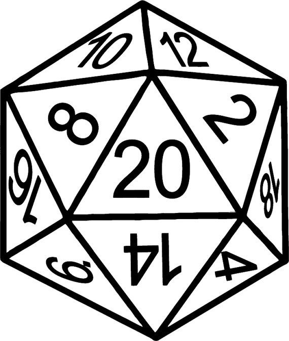</center>


## What is P-hacking? 

 - Also called "data dredging", is the misuse of data analysis methods to identify statistically significant results, which increases the risk of false positive findings.

 - There are two principle causes of publication bias:

    1. The "file drawer effect": non-significant results are under-reported

    2. And "P-hacking": selective reporting of only significant results 

    Wikipedia page: [Data dredging](https://en.wikipedia.org/wiki/Data_dredging) 


## A demonstration

 - Generate 2 randomly sampled datasets in R

```{r}
      n<-20
      (x<-rnorm(n))
      (y<-rnorm(n))
```

## A demonstration -- test for a significant difference 

```{r}
t.test(x, y)
```

## A demonstration -- another test for a significant difference 

```{r}
t.test(x, y, alternative = "less")

```

## A demonstration  -- another test for a significant difference 

```{r}
t.test(x, y, alternative = "greater")
```


## A demonstration  -- another test for a significant difference 

```{r}
wilcox.test(x,y)
```

## A demonstration  -- lots of other tests 

 - cor.test

 - ks.test

 - kruskal.test

 - var.test

 - anova

 - chisq.test

 - shapiro.test


## My unethical employer needs "significance" 

 - Keep resampling/adding data until you get the desired result: 

```{r}
 for (l in 1:100){
      y  <- rnorm(50)
      x  <- rnorm(50) 
      p <- t.test(x, y)$p.value
      if(p < 0.05){
           cat("Test [", l, "] is significant (p=", p, "). You can publish this one!\n")
      }
}
```

## How can we know if this is a real problem?

 - P-curves may tell us a lot:

<center>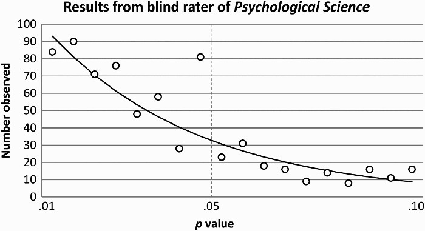</center>


 - **A peculiar prevalence of p values just below .05**:
    <BR>
    Masicampo EJ, Lalande DR. Quarterly journal of experimental psychology. 2012 Nov;65(11):2271-9.
    <BR> 
    doi: [10.1080/17470218.2012.711335](https://doi.org/10.1080/17470218.2012.711335) 


## Spurious correlations

 - Website: [https://www.tylervigen.com/spurious-correlations](https://www.tylervigen.com/spurious-correlations) 

<center>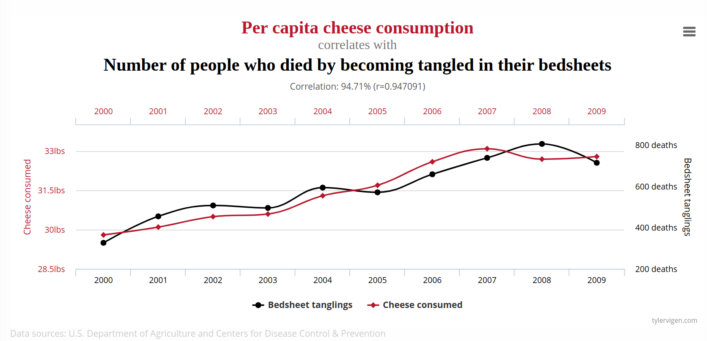</center>


## Solutions? 

## 

<center>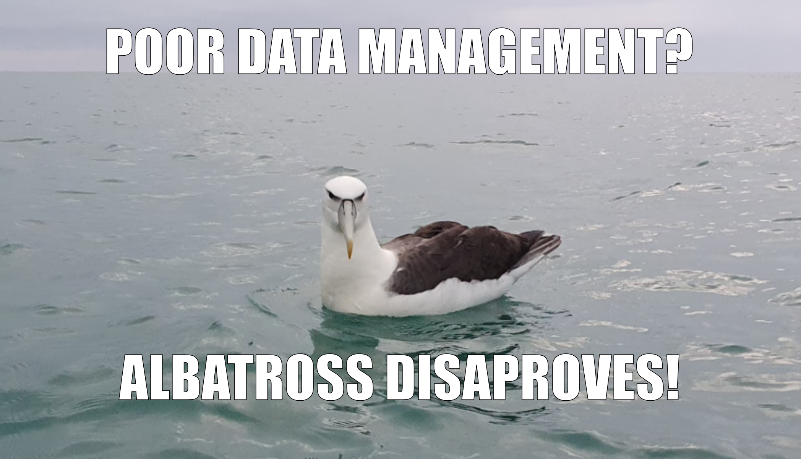</center>

